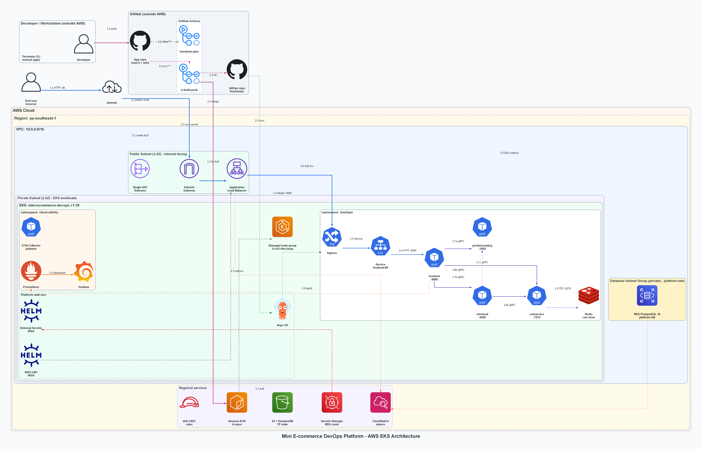
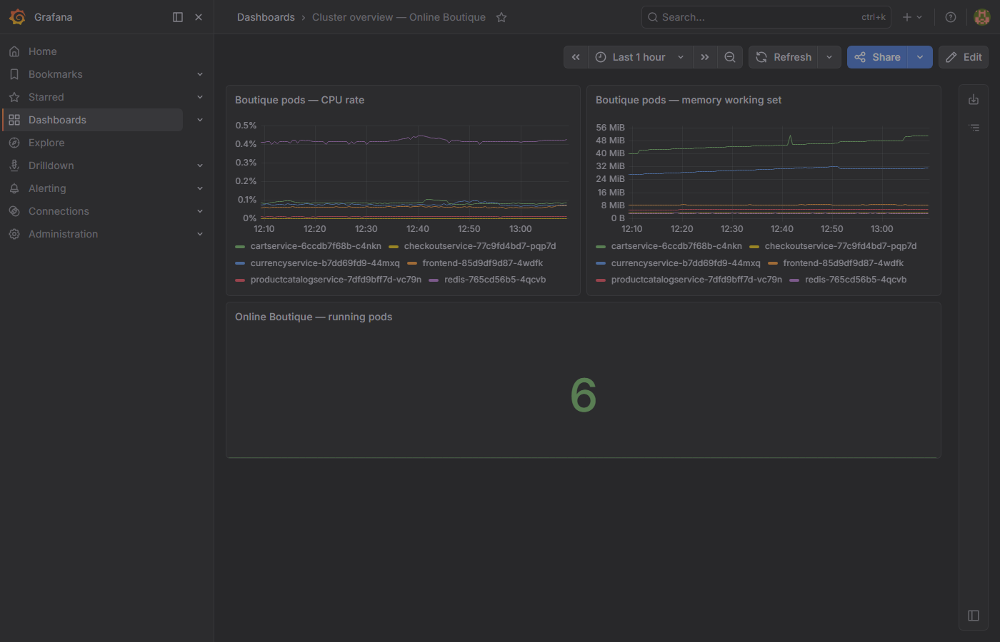

# Mini E-commerce DevOps Platform

<!-- markdownlint-disable MD024 MD033 MD036 MD060 -->

<div align="center">

**A bilingual Cloud/DevOps portfolio project built around a real microservices e-commerce workload.**<br>
**Dự án portfolio Cloud/DevOps song ngữ, xây dựng trên workload microservices e-commerce thực tế.**

[](https://github.com/VoAnhKiet1410/mini-ecommerce-devops/actions/workflows/ci-build-push.yml)
[](https://github.com/VoAnhKiet1410/mini-ecommerce-devops/actions/workflows/terraform-plan.yml)
[](https://github.com/VoAnhKiet1410/mini-ecommerce-devops/actions/workflows/security-scan.yml)

**AWS EKS · Terraform · GitHub Actions · GitOps · Argo CD · ECR · RDS · Prometheus · Grafana · CloudWatch · Trivy · Checkov · cosign · SBOM**

[Architecture](docs/architecture.md) · [AWS Runbook](docs/runbooks/aws-up.md) · [Teardown](docs/runbooks/aws-down.md) · [Demo Checklist](docs/runbooks/demo-checklist.md) · [Supply Chain](docs/runbooks/supply-chain.md)

</div>

---

## English

### Overview

This repository is a recruiter-facing DevOps portfolio project by [VoAnhKiet1410](https://github.com/VoAnhKiet1410). It wraps Google's [Online Boutique microservices demo](https://github.com/GoogleCloudPlatform/microservices-demo) with a complete DevOps platform: local development, AWS infrastructure, CI/CD, GitOps deployment, security scanning, image signing, SBOM attestation, observability, and teardown runbooks.

The AWS environment is intentionally **ephemeral**: bring it up for a demo, verify the platform, then run `terraform destroy` to control cost. The infrastructure, automation, and documentation remain reproducible in code.

### What This Project Demonstrates

| Area | Implementation |
|------|----------------|
| Infrastructure as Code | Terraform modules for VPC, EKS, ECR, RDS, IAM OIDC, IRSA, Secrets Manager, and CloudWatch |
| CI/CD | GitHub Actions with OIDC, matrix Docker builds, Trivy gates, ECR push, and GitOps image-bump PRs |
| GitOps | Two-repository model with Argo CD and Kustomize manifests in `mini-ecommerce-gitops` |
| Security | Checkov, Trivy, cosign keyless signing, syft SBOM generation, OCI attestations |
| Observability | Prometheus, Grafana dashboard, CloudWatch alarms for RDS and ALB |
| Operations | Runbooks for AWS bring-up, verification, monitoring, incident response, and teardown |

### Architecture



```text
Developer / GitHub
  |-- Source code, Terraform, workflows, runbooks
  |-- GitHub Actions: test, scan, build, sign, push, update GitOps
  |-- GitOps repo: Kustomize manifests and Argo CD applications

AWS ap-southeast-1
  |-- ECR: happy-path service images
  |-- EKS 1.30: frontend, product catalog, cart, checkout, Redis, Argo CD, ESO, monitoring
  |-- ALB: public HTTP entry point for the demo
  |-- RDS PostgreSQL 16: platform database foundation
  |-- Secrets Manager: RDS credentials synced by External Secrets Operator
  |-- CloudWatch: alarms for RDS and ALB health
```

For the full Mermaid diagram, see [`docs/architecture.md`](docs/architecture.md).

### Two-Repository GitOps Model

| Repository | Purpose |
|------------|---------|
| [`mini-ecommerce-devops`](https://github.com/VoAnhKiet1410/mini-ecommerce-devops) | Application source, Terraform infrastructure, CI workflows, scripts, and runbooks |
| [`mini-ecommerce-gitops`](https://github.com/VoAnhKiet1410/mini-ecommerce-gitops) | Kubernetes Kustomize base/overlays and Argo CD application manifests |

The CI pipeline builds images and pushes them to ECR. It then opens a GitOps image-bump PR. After review and merge, Argo CD syncs the updated manifests to EKS.

### Service Scope

This project focuses on the happy path instead of deploying every upstream Online Boutique service.

| Service | Language | Runtime Scope | Storage |
|---------|----------|---------------|---------|
| `frontend` | Go | Local + EKS | Stateless |
| `productcatalogservice` | Go | Local + EKS | In-memory JSON catalog |
| `cartservice` | C# .NET | Local + EKS | Redis |
| `checkoutservice` | Go | Local + EKS | Stateless orchestrator |
| `currencyservice` | Node.js | Local Compose only | JSON rates |
| `shippingservice` | Go | Local Compose only | Stateless mock |
| `paymentservice` | Node.js | Local Compose only | Stateless mock |
| `emailservice` | Python | Local Compose only | Stateless mock |

### Tech Stack

| Layer | Tools |
|-------|-------|
| Cloud | AWS `ap-southeast-1`, EKS 1.30, ECR, RDS PostgreSQL 16, ALB, Secrets Manager, CloudWatch |
| IaC | Terraform `>= 1.5`, S3 remote state, DynamoDB state lock |
| Containers | Docker, Docker Compose, multi-stage Dockerfiles |
| Kubernetes | EKS, Argo CD, Kustomize, External Secrets Operator, AWS Load Balancer Controller |
| CI/CD | GitHub Actions, GitHub OIDC, Docker Buildx, Dependabot |
| Security | Trivy, Checkov, cosign keyless signing, syft SBOM, optional Kyverno policy |
| Observability | Prometheus, Grafana, kube-prometheus-stack, CloudWatch alarms |

### Local Quick Start

```bash
git clone https://github.com/VoAnhKiet1410/mini-ecommerce-devops.git
cd mini-ecommerce-devops
cp .env.example .env
docker compose up --build -d
```

Verify the local stack:

```bash
# Linux / macOS
./scripts/smoke-local.sh
./scripts/verify-platform-db.sh

# Windows PowerShell
.\scripts\smoke-local.ps1
.\scripts\verify-platform-db.ps1
```

Open the storefront at [http://localhost:8080](http://localhost:8080).

### AWS Demo Flow

> Cost note: the AWS stack is designed for short demos. Destroy it after use.

```bash
# 1. Bootstrap remote state, first time only
cd infra/bootstrap/state
cp terraform.tfvars.example terraform.tfvars
terraform init
terraform apply

# 2. Plan and apply AWS environment manually
cd ../../environments/aws
cp backend.hcl.example backend.hcl
cp terraform.tfvars.example terraform.tfvars
terraform init -backend-config=backend.hcl
terraform plan -out=tfplan
terraform apply tfplan
```

Then install cluster tooling in order:

```powershell
aws eks update-kubeconfig --region ap-southeast-1 --name mini-ecommerce-devops
.\scripts\install-aws-lbc.ps1
.\scripts\install-eso.ps1
.\scripts\install-argocd.ps1
.\scripts\install-monitoring.ps1
.\scripts\verify-phase4.ps1
```

Teardown when the demo is complete:

```bash
cd infra/environments/aws
terraform destroy
```

Detailed steps are documented in [`docs/runbooks/aws-up.md`](docs/runbooks/aws-up.md) and [`docs/runbooks/aws-down.md`](docs/runbooks/aws-down.md).

### CI/CD Pipeline

| Workflow | Purpose |
|----------|---------|
| [`ci-build-push.yml`](.github/workflows/ci-build-push.yml) | Tests selected services, builds happy-path images, scans with Trivy, pushes to ECR, signs images, creates SBOM attestations, and opens GitOps PRs |
| [`terraform-plan.yml`](.github/workflows/terraform-plan.yml) | Runs `terraform fmt`, `validate`, `plan`, Checkov, and Infracost comments on infrastructure PRs |
| [`security-scan.yml`](.github/workflows/security-scan.yml) | Runs scheduled and PR security scans with Checkov and Trivy filesystem scanning |

### Observability



Prometheus and Grafana provide Kubernetes workload visibility, while CloudWatch alarms cover RDS CPU, RDS free storage, and ALB 5xx target errors.

### Portfolio Highlights

- Built an end-to-end DevOps platform around a real microservices workload instead of a toy single-service demo.
- Provisioned AWS EKS, ECR, RDS, ALB, IAM OIDC, IRSA, Secrets Manager, and CloudWatch with reusable Terraform modules.
- Implemented credential-free CI/CD using GitHub OIDC instead of long-lived AWS keys.
- Added supply chain security with Trivy, Checkov, cosign keyless image signing, syft SBOMs, and OCI attestations.
- Designed a two-repository GitOps workflow where CI opens image-bump PRs and Argo CD deploys after review.
- Documented operational runbooks for deployment, verification, monitoring, incident response, and teardown.

---

## Tiếng Việt

### Tổng Quan

Repository này là dự án portfolio DevOps của [VoAnhKiet1410](https://github.com/VoAnhKiet1410), được xây dựng trên nền tảng [Online Boutique microservices demo](https://github.com/GoogleCloudPlatform/microservices-demo) của Google. Mục tiêu là thể hiện năng lực Cloud/DevOps qua một workload microservices thực tế: phát triển local, hạ tầng AWS, CI/CD, GitOps, security scanning, image signing, SBOM, observability và runbook vận hành.

Môi trường AWS được thiết kế theo hướng **ephemeral**: bật lên để demo, kiểm tra toàn bộ platform, sau đó chạy `terraform destroy` để kiểm soát chi phí. Toàn bộ hạ tầng và quy trình vẫn được lưu lại dưới dạng code để tái tạo bất cứ lúc nào.

### Dự Án Thể Hiện Điều Gì

| Mảng | Cách triển khai |
|------|-----------------|
| Infrastructure as Code | Terraform modules cho VPC, EKS, ECR, RDS, IAM OIDC, IRSA, Secrets Manager và CloudWatch |
| CI/CD | GitHub Actions dùng OIDC, build Docker theo matrix, Trivy gate, push ECR và tự mở PR cập nhật GitOps |
| GitOps | Mô hình 2 repository với Argo CD và Kustomize manifests trong `mini-ecommerce-gitops` |
| Security | Checkov, Trivy, cosign keyless signing, syft SBOM, OCI attestations |
| Observability | Prometheus, Grafana dashboard, CloudWatch alarms cho RDS và ALB |
| Operations | Runbook từng bước cho bring-up AWS, verify, monitoring, incident response và teardown |

### Kiến Trúc


```text
Developer / GitHub
  |-- Source code, Terraform, workflows, runbooks
  |-- GitHub Actions: test, scan, build, sign, push, update GitOps
  |-- GitOps repo: Kustomize manifests và Argo CD applications

AWS ap-southeast-1
  |-- ECR: images của các happy-path services
  |-- EKS 1.30: frontend, product catalog, cart, checkout, Redis, Argo CD, ESO, monitoring
  |-- ALB: public HTTP entry point cho demo
  |-- RDS PostgreSQL 16: nền tảng platform database
  |-- Secrets Manager: RDS credentials được sync bởi External Secrets Operator
  |-- CloudWatch: alarms cho sức khỏe RDS và ALB
```

Sơ đồ đầy đủ nằm trong [`docs/architecture.md`](docs/architecture.md).

### Mô Hình GitOps 2 Repository

| Repository | Vai trò |
|------------|---------|
| [`mini-ecommerce-devops`](https://github.com/VoAnhKiet1410/mini-ecommerce-devops) | Source code ứng dụng, Terraform infrastructure, CI workflows, scripts và runbooks |
| [`mini-ecommerce-gitops`](https://github.com/VoAnhKiet1410/mini-ecommerce-gitops) | Kubernetes Kustomize base/overlays và Argo CD application manifests |

CI build image và push lên ECR, sau đó mở PR cập nhật image tag ở GitOps repo. Sau khi review và merge, Argo CD tự đồng bộ manifest mới lên EKS.

### Phạm Vi Service

Project tập trung vào happy path thay vì deploy toàn bộ service từ upstream Online Boutique.

| Service | Ngôn ngữ | Phạm vi chạy | Lưu trữ |
|---------|----------|--------------|---------|
| `frontend` | Go | Local + EKS | Stateless |
| `productcatalogservice` | Go | Local + EKS | Catalog JSON in-memory |
| `cartservice` | C# .NET | Local + EKS | Redis |
| `checkoutservice` | Go | Local + EKS | Orchestrator stateless |
| `currencyservice` | Node.js | Chỉ local Compose | JSON rates |
| `shippingservice` | Go | Chỉ local Compose | Mock stateless |
| `paymentservice` | Node.js | Chỉ local Compose | Mock stateless |
| `emailservice` | Python | Chỉ local Compose | Mock stateless |

### Công Nghệ Sử Dụng

| Layer | Công nghệ |
|-------|-----------|
| Cloud | AWS `ap-southeast-1`, EKS 1.30, ECR, RDS PostgreSQL 16, ALB, Secrets Manager, CloudWatch |
| IaC | Terraform `>= 1.5`, S3 remote state, DynamoDB state lock |
| Containers | Docker, Docker Compose, multi-stage Dockerfiles |
| Kubernetes | EKS, Argo CD, Kustomize, External Secrets Operator, AWS Load Balancer Controller |
| CI/CD | GitHub Actions, GitHub OIDC, Docker Buildx, Dependabot |
| Security | Trivy, Checkov, cosign keyless signing, syft SBOM, tùy chọn Kyverno policy |
| Observability | Prometheus, Grafana, kube-prometheus-stack, CloudWatch alarms |

### Chạy Local Nhanh

```bash
git clone https://github.com/VoAnhKiet1410/mini-ecommerce-devops.git
cd mini-ecommerce-devops
cp .env.example .env
docker compose up --build -d
```

Kiểm tra local stack:

```bash
# Linux / macOS
./scripts/smoke-local.sh
./scripts/verify-platform-db.sh

# Windows PowerShell
.\scripts\smoke-local.ps1
.\scripts\verify-platform-db.ps1
```

Mở storefront tại [http://localhost:8080](http://localhost:8080).

### Luồng Demo Trên AWS

> Lưu ý chi phí: AWS stack chỉ nên bật trong thời gian demo. Hãy destroy sau khi dùng xong.

```bash
# 1. Bootstrap remote state, chỉ cần làm lần đầu
cd infra/bootstrap/state
cp terraform.tfvars.example terraform.tfvars
terraform init
terraform apply

# 2. Plan và apply AWS environment thủ công
cd ../../environments/aws
cp backend.hcl.example backend.hcl
cp terraform.tfvars.example terraform.tfvars
terraform init -backend-config=backend.hcl
terraform plan -out=tfplan
terraform apply tfplan
```

Sau đó cài tooling trong cluster theo đúng thứ tự:

```powershell
aws eks update-kubeconfig --region ap-southeast-1 --name mini-ecommerce-devops
.\scripts\install-aws-lbc.ps1
.\scripts\install-eso.ps1
.\scripts\install-argocd.ps1
.\scripts\install-monitoring.ps1
.\scripts\verify-phase4.ps1
```

Destroy sau khi demo xong:

```bash
cd infra/environments/aws
terraform destroy
```

Chi tiết nằm trong [`docs/runbooks/aws-up.md`](docs/runbooks/aws-up.md) và [`docs/runbooks/aws-down.md`](docs/runbooks/aws-down.md).

### CI/CD Pipeline

| Workflow | Vai trò |
|----------|---------|
| [`ci-build-push.yml`](.github/workflows/ci-build-push.yml) | Test service, build image happy-path, scan bằng Trivy, push ECR, sign image, tạo SBOM attestation và mở GitOps PR |
| [`terraform-plan.yml`](.github/workflows/terraform-plan.yml) | Chạy `terraform fmt`, `validate`, `plan`, Checkov và Infracost comment trên PR hạ tầng |
| [`security-scan.yml`](.github/workflows/security-scan.yml) | Chạy security scan định kỳ và trên PR bằng Checkov + Trivy filesystem scan |

### Observability


Prometheus và Grafana cung cấp góc nhìn về workload Kubernetes; CloudWatch alarms theo dõi RDS CPU, dung lượng trống của RDS và lỗi ALB 5xx.

### Điểm Nhấn Portfolio

- Xây dựng platform DevOps end-to-end trên workload microservices thực tế, không phải demo một service đơn giản.
- Provision AWS EKS, ECR, RDS, ALB, IAM OIDC, IRSA, Secrets Manager và CloudWatch bằng Terraform modules có thể tái sử dụng.
- Triển khai CI/CD không dùng long-lived AWS keys nhờ GitHub OIDC.
- Bổ sung supply chain security với Trivy, Checkov, cosign keyless signing, syft SBOM và OCI attestations.
- Thiết kế GitOps 2 repository: CI mở PR cập nhật image tag, Argo CD deploy sau khi review.
- Viết runbook vận hành cho deployment, verification, monitoring, incident response và teardown.

---

## Repository Structure

```text
.
|-- .github/workflows/          # CI build/push, Terraform plan, security scan
|-- src/                        # Microservices source code
|-- infra/                      # Terraform bootstrap, AWS environment, reusable modules
|-- observability/aws/          # Grafana dashboards and Helm values
|-- scripts/                    # PowerShell and Bash automation scripts
|-- docs/                       # Architecture docs, runbooks, demo checklist
|-- docker-compose.yml          # Local development stack
`-- README.md
```

## Key Runbooks

| Document | Purpose |
|----------|---------|
| [`docs/runbooks/aws-up.md`](docs/runbooks/aws-up.md) | AWS stack bring-up |
| [`docs/runbooks/aws-down.md`](docs/runbooks/aws-down.md) | Safe AWS teardown |
| [`docs/runbooks/github-actions-setup.md`](docs/runbooks/github-actions-setup.md) | GitHub secrets and OIDC setup |
| [`docs/runbooks/observability.md`](docs/runbooks/observability.md) | Prometheus, Grafana, and CloudWatch setup |
| [`docs/runbooks/supply-chain.md`](docs/runbooks/supply-chain.md) | Image signing, SBOM, and verification |
| [`docs/runbooks/demo-checklist.md`](docs/runbooks/demo-checklist.md) | Recruiter demo checklist |
| [`docs/runbooks/incident-response.md`](docs/runbooks/incident-response.md) | Incident response playbook |

## Important Notes

- Terraform `apply` is manual only. CI must never apply infrastructure.
- AWS resources are demo-oriented and should be destroyed after use.
- RDS is a platform database foundation; Phase 1 app data remains Redis and in-memory catalog.
- GitOps manifests live in a separate repository and should not be merged into this app repository.
- Do not commit `.env`, `terraform.tfvars`, `backend.hcl`, `tfplan`, state files, or real secrets.

## Contributors

<table>
  <tr>
    <td align="center">
      <a href="https://github.com/VoAnhKiet1410">
        
        <br />
        <sub><strong>VoAnhKiet1410</strong></sub>
      </a>
    </td>
  </tr>
</table>

---

<div align="center">

**Built by [VoAnhKiet1410](https://github.com/VoAnhKiet1410) for Cloud/DevOps portfolio demonstration.**<br>
**Được xây dựng bởi [VoAnhKiet1410](https://github.com/VoAnhKiet1410) cho mục tiêu portfolio Cloud/DevOps.**

</div>
