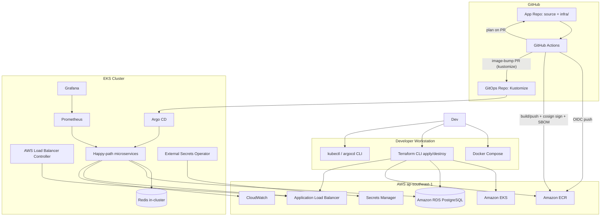

# Architecture

Mini E-commerce DevOps Platform wraps [Google microservices-demo](https://github.com/GoogleCloudPlatform/microservices-demo) (Online Boutique) with a narrow **happy-path** runtime scope, plus platform tooling: Docker Compose locally, ephemeral AWS (EKS, ECR, RDS, ALB) via Terraform, GitHub Actions CI (OIDC), Argo CD GitOps, and Prometheus/Grafana/CloudWatch observability.

## System context

## Happy-path services (Phase 1 runtime)

| Service | Role | App data store (Phase 1) |
|---------|------|-------------------------|
| `frontend` | Web UI | Calls backends |
| `productcatalogservice` | Product API | In-memory catalog (upstream) |
| `cartservice` | Cart API | **Redis** |
| `checkoutservice` | Order orchestration | Calls other services |

**Local Compose note:** Compose runs happy-path services plus `currencyservice`, `shippingservice`, `paymentservice`, and `emailservice` so browse, cart (shipping quote), and checkout work locally. Optional demo services (`adservice`, `recommendationservice`, …) are still omitted.

### Excluded from Phase 1 deploy scope

`payment`, `shipping`, `email`, `ads`, `recommendations`, `loadgenerator`, and other full-demo services (target: EKS GitOps overlay only for happy-path images).

## Platform vs application storage

| Component | Local (Compose) | AWS |
|-----------|-----------------|-----|
| Redis | `redis` service | In-cluster Deployment |
| PostgreSQL | `postgres` service | **Amazon RDS** (platform DB) |

RDS and Compose PostgreSQL are **platform databases**: provisioned and documented for DevOps learning and future integration. Application services keep upstream semantics (Redis cart, in-memory catalog) in Phase 1—see spec Approach A.

## Two-repository model

| Repository | Contents |
|------------|----------|
| `mini-ecommerce-devops` (app) | `src/`, `infra/`, `docker-compose.yml`, CI workflows, runbooks |
| `mini-ecommerce-gitops` | Kustomize `base/` + `overlays/aws/`, Argo CD Applications |

Images: CI builds from vendored `src/` → ECR (signed with cosign, SBOM attested); CI then opens an image-bump PR on `mini-ecommerce-gitops` pinning Kustomize tags to the commit SHA; after review + merge, Argo CD syncs overlay `aws`.

## Design decisions

1. **Approach A (platform shell):** Maximize Terraform, CI/CD, GitOps, and security story; minimize app forks.
2. **Single AWS environment:** `infra/environments/aws`, region `ap-southeast-1`, one managed node group—demo only.
3. **Ephemeral AWS:** Stack up for portfolio demos; **`terraform destroy` when idle** (see [runbooks/aws-down.md](runbooks/aws-down.md)).
4. **Secrets:** AWS Secrets Manager + External Secrets on EKS; local `.env` from `.env.example` (never commit `.env`).
5. **CI auth:** GitHub OIDC to AWS; ECR push in CI; Terraform **plan** on PR, **apply** manual locally.
6. **No custom DNS in Phase 1:** ALB hostname only (Route 53 / ACM deferred).

## Related docs

- [blog/kien-truc-mini-ecommerce-devops.md](blog/kien-truc-mini-ecommerce-devops.md) — bài blog kiến trúc (tiếng Việt)
- [aws-up.md](runbooks/aws-up.md) — bring-up sequence
- [aws-down.md](runbooks/aws-down.md) — teardown
- [demo-checklist.md](runbooks/demo-checklist.md) — recruiter demo script
- [supply-chain.md](runbooks/supply-chain.md) — cosign signing, SBOM, verification
- Spec: [docs/superpowers/specs/2026-06-01-mini-ecommerce-devops-platform-spec.md](superpowers/specs/2026-06-01-mini-ecommerce-devops-platform-spec.md)
