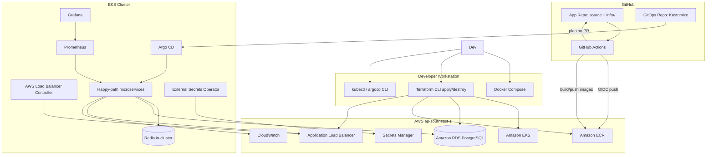
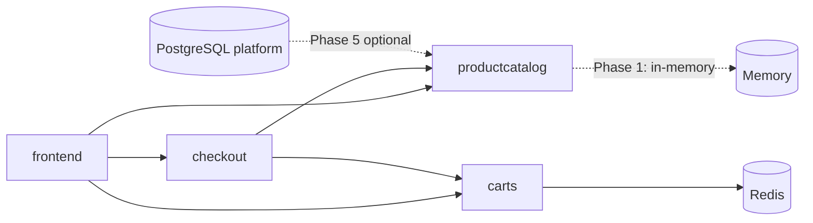

# Mini E-commerce DevOps Platform — Project Specification

| Field | Value |
|-------|--------|
| **Version** | 1.0 |
| **Date** | 2026-06-01 |
| **Status** | Draft — pending stakeholder review |
| **Audience** | Solo builder targeting Cloud/DevOps Intern roles |
| **Documentation language** | English (README, diagrams, CV bullets) |

---

## 1. Executive Summary

This project delivers a **portfolio-grade DevOps platform** around Google’s **[microservices-demo](https://github.com/GoogleCloudPlatform/microservices-demo)** (Online Boutique), with a deliberately **narrow runtime scope** (happy-path services only). The goal is demonstrable evidence of:

- Containerized local development (**Docker Compose** + **PostgreSQL**)
- AWS cloud footprint (**EKS**, **ECR**, **RDS PostgreSQL**, **ALB**)
- **Infrastructure as Code** (**Terraform** in `infra/` of the app repo)
- **CI/CD** (**GitHub Actions** with **OIDC** to AWS)
- **GitOps** (**Argo CD**, separate manifest repo, **Kustomize** overlays)
- **Observability** (**CloudWatch**, **Prometheus**, **Grafana**)
- **Security guardrails** (**Trivy**, **Checkov**, no hard-coded secrets, **Secrets Manager** + **External Secrets Operator**)

Operations assume a **single AWS “prod-like” environment** that is **provisioned only for demos/learning** and **torn down frequently** (`terraform destroy`) to control cost. Custom DNS (**Route 53**, **ACM**) is **deferred**; Phase 1 uses the **ALB hostname** only.

---

## 2. Goals and Non-Goals

### 2.1 Goals

| ID | Goal |
|----|------|
| G1 | Run microservices-demo **happy path** locally via Docker Compose with PostgreSQL available for platform learning |
| G2 | Provision reproducible AWS infrastructure with Terraform (`ap-southeast-1`) |
| G3 | Build container images in CI, push to **ECR**, deploy to **EKS** via **Argo CD** |
| G4 | Store runtime secrets in **AWS Secrets Manager**, sync to cluster with **ESO** |
| G5 | Enforce security scanning in CI (**Trivy**, **Checkov**) without committing secrets |
| G6 | Provide English README, architecture diagram, and CV-ready bullet points |
| G7 | Public GitHub repos suitable for recruiter review |

### 2.2 Non-Goals (Phase 1)

| ID | Non-goal |
|----|----------|
| NG1 | Deploy full microservices-demo (all services) |
| NG2 | Multi-environment AWS (staging/prod tiers) |
| NG3 | 24/7 production SLOs, HA, or multi-AZ optimization |
| NG4 | Custom domain, Route 53, ACM HTTPS (Phase 4 optional) |
| NG5 | Migrate application logic to PostgreSQL (optional Phase 5) |
| NG6 | Service mesh (Istio/Linkerd) unless explicitly added later |
| NG7 | Automated `terraform apply` from CI |

---

## 3. Stakeholder Decisions (Interview Record)

| Topic | Decision |
|-------|----------|
| Base application | Google **microservices-demo** |
| K8s service scope | **Happy path**: `frontend`, `productcatalog`, `carts`, `checkout` + dependencies (e.g. Redis for carts) |
| IaC | **Terraform** in **`infra/`** inside **app repo** |
| Repositories | **2 repos**: (1) app + infra, (2) GitOps manifests |
| AWS environments | **Local dev** + **one AWS prod-like** (`aws` / `prod-like`) |
| AWS region | **ap-southeast-1** (Singapore) |
| Cost model | **Ephemeral AWS** — stack up for demo, **destroy when idle** |
| PostgreSQL / RDS | **Platform DB** in Phase 1; apps keep upstream Redis/in-memory; optional catalog→Postgres later |
| Secrets | **AWS Secrets Manager** + **External Secrets Operator**; local `.env` + `env.example` |
| CI → AWS auth | **GitHub OIDC**; **ECR push in CI**; **Terraform plan on PR**, **apply manual local** |
| K8s manifests | **Kustomize** (base + overlays) |
| GitHub visibility | **Both repos public** |
| Docs / CV language | **English** |
| DNS / TLS | **No custom domain** in Phase 1; ALB DNS only |
| Timeline | **No fixed deadline** — phased priorities only |
| EKS compute | **1× Managed Node Group**, **1× On-Demand** node (`t3.small` or `t4g.small`) |

---

## 4. Architectural Approaches Considered

### 4.1 Approach A — **Recommended: “Platform shell + upstream semantics”**

- **Idea**: Keep microservices-demo **application behavior** as upstream (Redis, in-memory catalog). Provision **RDS PostgreSQL** as a **platform database** (documented, connected for future use). Focus engineering on Terraform, EKS, CI/CD, GitOps, security, and observability.
- **Pros**: Fastest path to a complete DevOps story; fewer app forks; aligns with teardown cost model.
- **Cons**: CV must honestly state “RDS provisioned; catalog integration planned/optional.”

### 4.2 Approach B — “App-integrated RDS”

- **Idea**: Fork **productcatalog** (minimum) to persist data in PostgreSQL locally and on RDS.
- **Pros**: Stronger “e-commerce + database” narrative.
- **Cons**: Shifts effort to application development; higher test burden.

### 4.3 Approach C — “Upstream images only, minimal CI build”

- **Idea**: Deploy public `gcr.io` images to EKS; CI only validates manifests and infra.
- **Pros**: Very low CI complexity.
- **Cons**: Weak “built and pushed to ECR” CV evidence.

**Recommendation**: **Approach A** for Phases 1–3; treat **Approach B** as optional **Phase 5**. Use **Approach C** only as a temporary bootstrap step if ECR pipeline is not ready (not the target end state).

---

## 5. System Context



---

## 6. Service Scope (Happy Path)

### 6.1 Deployed services

| Service | Role | Upstream data store (Phase 1) |
|---------|------|--------------------------------|
| `frontend` | Web UI | Calls backends |
| `productcatalog` | Product API | In-memory (upstream default) |
| `carts` | Cart API | **Redis** |
| `checkout` | Order orchestration | Calls other services |

### 6.2 Required dependencies

| Component | Local (Compose) | AWS (EKS) |
|-----------|-----------------|-----------|
| Redis | Container in Compose network | **In-cluster** Deployment (or ElastiCache in future cost tier) |
| PostgreSQL | **Compose `postgres` service** | **Amazon RDS PostgreSQL** (platform DB) |

### 6.3 Explicitly excluded (Phase 1)

`payment`, `shipping`, `currency`, `email`, `ads`, `recommendations`, `loadgenerator`, and other demo services.

### 6.4 Image strategy (target)

| Stage | Policy |
|-------|--------|
| Bootstrap (optional) | May reference upstream `gcr.io/google-samples/*` images temporarily in Kustomize |
| Target | **CI builds** from vendored/forked microservices-demo source (or submodule), **tags to ECR**, GitOps references **ECR digests/tags** |

---

## 7. Environments and Naming

| Environment | Purpose | Orchestration | Cluster/DB |
|-------------|---------|---------------|------------|
| `local` | Daily development | Docker Compose | Local PostgreSQL + local Redis |
| `aws` (prod-like) | Portfolio demo on AWS | EKS + Argo CD | RDS PostgreSQL + in-cluster Redis |

**Kustomize overlays**: `overlays/local` (for kind/minikube optional), `overlays/aws` (production-like).

**Terraform workspace or directory**: `infra/environments/aws` (single env).

---

## 8. Repository Model

### 8.1 App repository (public)

**Suggested name**: `mini-ecommerce-devops` (or `microservices-demo-devops`)

```
app-repo/
├── src/                          # microservices-demo fork or git submodule
├── docker-compose.yml
├── docker-compose.override.example.yml
├── .env.example
├── infra/
│   ├── modules/
│   │   ├── vpc/
│   │   ├── eks/
│   │   ├── rds/
│   │   ├── ecr/
│   │   ├── alb-controller/       # IAM + helm bootstrap notes
│   │   └── secrets/
│   ├── environments/
│   │   └── aws/
│   │       ├── main.tf
│   │       ├── variables.tf
│   │       ├── outputs.tf
│   │       └── terraform.tfvars.example
│   └── README.md
├── .github/
│   └── workflows/
│       ├── ci-build-push.yml     # test, build, push ECR (OIDC)
│       ├── terraform-plan.yml    # plan on PR
│       ├── security-scan.yml     # Trivy, Checkov
│       └── update-gitops.yml     # optional: bump image tag in GitOps repo
├── docs/
│   ├── architecture.md
│   ├── runbooks/
│   │   ├── aws-up.md
│   │   ├── aws-down.md
│   │   └── demo-checklist.md
│   └── superpowers/specs/        # this document
└── README.md
```

### 8.2 GitOps repository (public)

**Suggested name**: `mini-ecommerce-gitops`

```
gitops-repo/
├── bootstrap/
│   └── argocd/                   # App-of-apps root (optional)
├── apps/
│   └── online-boutique/
│       ├── base/
│       │   ├── kustomization.yaml
│       │   ├── namespace.yaml
│       │   ├── frontend/
│       │   ├── productcatalog/
│       │   ├── carts/
│       │   ├── checkout/
│       │   ├── redis/
│       │   └── external-secrets/
│       └── overlays/
│           └── aws/
│               ├── kustomization.yaml
│               ├── patches/
│               └── configmap-generator or replacements for ECR URIs
├── clusters/
│   └── aws/
│       └── apps.yaml             # Argo CD Application manifests
└── README.md
```

---

## 9. Local Development Platform

### 9.1 Requirements

- **Windows 10/11** with **WSL2** recommended, or native Docker Desktop
- Docker Compose v2
- `kubectl` (optional for local K8s experiments)
- Terraform >= 1.5, AWS CLI v2, `aws configure` profile for lab account

### 9.2 Docker Compose stack

| Service | Notes |
|---------|--------|
| Happy-path microservices | Built from local Dockerfiles or pre-built dev images |
| `redis` | Required for `carts` |
| `postgres` | Platform DB; credentials from `.env` |
| Networking | Single compose network; published port for `frontend` (e.g. `8080`) |

### 9.3 Local secrets

- **Never commit** `.env`
- Provide **`.env.example`** with dummy values
- Document `cp .env.example .env` in README

### 9.4 Local PostgreSQL usage (Phase 1)

- Container running and reachable
- Optional: run schema migration / seed job proving connectivity (recommended for honesty in README)
- Application services **may not** use Postgres yet — document clearly under “Platform DB”

---

## 10. AWS Infrastructure (Terraform)

### 10.1 Resources (aws environment)

| Resource | Specification (initial) |
|----------|-------------------------|
| VPC | 2 AZs, public + private subnets, **1 NAT Gateway** (cost-aware) |
| EKS | 1 cluster, **1 MNG**, **1×** `t3.small` or `t4g.small` On-Demand |
| ECR | Repositories per service image (or monorepo tags per service) |
| RDS | PostgreSQL **17.x** or **16.x**, `db.t4g.micro`, single-AZ, storage 20 GiB gp3 |
| ALB | Via **AWS Load Balancer Controller**, Ingress for `frontend` |
| IAM | OIDC provider for GitHub Actions; IRSA roles for LBC, ESO, optional observability |
| Secrets Manager | RDS master creds, ECR not needed; app config secrets as needed |
| CloudWatch | Control plane logs (optional), Container Insights or basic log groups |

### 10.2 Terraform practices

- Remote state: **S3 + DynamoDB lock** (bootstrap stack or documented one-time setup)
- `terraform.tfvars.example` only — no secrets in git
- **Checkov** in CI on `infra/`
- Tagging standard: `Project=mini-ecommerce-devops`, `Environment=aws`, `ManagedBy=terraform`

### 10.3 Apply policy

| Action | Where |
|--------|--------|
| `terraform plan` | GitHub Actions on pull request |
| `terraform apply` / `destroy` | **Manual on workstation** |
| Post-destroy | Document that RDS snapshots may incur storage unless skipped |

### 10.4 Ephemeral stack runbook (required doc)

**`docs/runbooks/aws-up.md`**

1. `terraform apply` (infra)
2. `aws eks update-kubeconfig`
3. Install **AWS Load Balancer Controller** (helm + IRSA)
4. Install **External Secrets Operator** + `ClusterSecretStore`
5. Install **Argo CD**; register GitOps repo
6. Sync `online-boutique` Application
7. Retrieve ALB URL; smoke test UI

**`docs/runbooks/aws-down.md`**

1. Scale down or delete Argo apps (optional)
2. `terraform destroy` (confirm RDS snapshot policy)
3. Verify no orphaned ELB/EBS charges

---

## 11. Database Strategy

### 11.1 Phase 1 — Platform PostgreSQL

| Layer | Implementation |
|-------|----------------|
| Local | PostgreSQL 16+ container; database e.g. `platform` |
| AWS | RDS PostgreSQL; credentials in Secrets Manager |
| Apps | **Unchanged upstream** persistence (Redis / in-memory) |

**README disclosure (required)**:

> RDS PostgreSQL is provisioned as the platform database. Happy-path microservices continue to use upstream storage (Redis, in-memory). Phase 5 optionally migrates product catalog to PostgreSQL.

### 11.2 Phase 5 (optional) — Catalog on PostgreSQL

- Fork `productcatalog` service
- Connection string via ESO
- Flyway/golang-migrate or equivalent
- Update CV bullet to include application data migration

---

## 12. CI/CD (GitHub Actions)

### 12.1 Workflows

| Workflow | Trigger | Actions |
|----------|---------|---------|
| `ci-build-push.yml` | Push to `main`, tags | Lint/test (if any), `docker build`, **Trivy** image scan, push to **ECR** (OIDC) |
| `terraform-plan.yml` | PR touching `infra/` | `terraform fmt -check`, `validate`, **Checkov**, `plan` comment |
| `security-scan.yml` | PR + schedule | Filesystem **Trivy**, IaC **Checkov**, secret scanning (GitHub secret scanning + gitleaks optional) |
| `update-gitops.yml` | After successful image push | PR to GitOps repo bumping image tag (GitHub App token or PAT stored as secret — not in repo) |

### 12.2 OIDC configuration

- IAM role trust policy: GitHub repo `repo:ORG/APP_REPO:*`
- Permissions: `ecr:GetAuthorizationToken`, `ecr:BatchCheckLayerAvailability`, `ecr:PutImage`, etc.
- **No long-lived AWS access keys** in GitHub

### 12.3 Terraform CI permissions

- Read-only role for `plan` on PRs
- **No** `apply` permission from CI

---

## 13. GitOps (Argo CD)

### 13.1 Bootstrap

- Argo CD installed on same EKS cluster (namespace `argocd`)
- Initial admin password retrieval documented once per cluster lifecycle
- GitOps repo connected via SSH deploy key or GitHub App (prefer fine-grained token stored in Secrets Manager)

### 13.2 Application model

| Argo CD Resource | Purpose |
|------------------|---------|
| `Application/online-boutique` | Sync `apps/online-boutique/overlays/aws` |
| `AppProject` | Restrict allowed repos/namespaces |

### 13.3 Sync policy

- **Manual sync** or automated sync with **prune disabled** initially for safer learning
- Document promotion: CI updates image tag → Argo detects drift → sync

### 13.4 Kustomize conventions

- `base/` — namespace, deployments, services, redis, service accounts
- `overlays/aws/` — ECR image replacements, resource limits, ingress annotations for ALB, ESO references

---

## 14. Secrets Management

| Context | Mechanism |
|---------|-----------|
| Local | `.env` (gitignored), `env.example` |
| AWS runtime | **Secrets Manager** secrets |
| EKS consumption | **External Secrets Operator** → Kubernetes `Secret` |
| CI | GitHub Actions secrets: `AWS_ROLE_ARN`, GitOps bump token (if used) |

### 14.1 Minimum secrets

| Secret | Consumer |
|--------|----------|
| RDS master username/password | ESO → optional admin jobs; not hard-coded in manifests |
| Redis password (if enabled) | carts |
| Argo CD repo credential | Argo |

### 14.2 Rules

- No secrets in Git (including encrypted unless Phase adds SOPS deliberately)
- **Checkov** policies: no hard-coded credentials in Terraform/K8s YAML
- Rotate GitHub tokens if leaked

---

## 15. Security

| Control | Implementation |
|---------|----------------|
| Image vulnerability scan | **Trivy** in CI (fail on CRITICAL optional, WARN on HIGH configurable) |
| IaC scan | **Checkov** on Terraform |
| Secret leakage | `.gitignore`, pre-commit optional, GitHub secret scanning |
| Cluster network | Private workers, public ALB only where needed |
| IAM | Least privilege OIDC roles; IRSA per controller |
| RDS | Not publicly accessible; security group from EKS nodes only |
| Pod security | Baseline PSS namespace annotation (document incremental hardening) |

---

## 16. Observability

### 16.1 Phase 3 target (in-cluster)

| Tool | Scope |
|------|--------|
| **Prometheus** | Scrape app metrics (where exposed), kube-state-metrics, node exporter |
| **Grafana** | Dashboards: cluster health, HTTP latency if available from demo |
| **CloudWatch** | EKS control plane (optional), RDS metrics, ALB access logs (optional S3) |

### 16.2 Constraints with ephemeral clusters

- Prometheus/Grafana data is **ephemeral** — acceptable for lab
- Export dashboard JSON to GitOps repo for reproducibility
- README states monitoring is demonstrated per cluster bring-up

### 16.3 Alerts (optional)

- CloudWatch alarm on RDS CPU/free storage
- No PagerDuty integration required

---

## 17. Networking and Ingress

| Item | Phase 1 |
|------|---------|
| Ingress controller | **AWS Load Balancer Controller** |
| Ingress resource | Routes to `frontend` Service |
| TLS | **HTTP on ALB** (no ACM in Phase 1) |
| DNS | ALB-generated hostname documented in demo checklist |

### 17.1 Deferred — Phase 4 (DNS/TLS)

- Route 53 hosted zone (optional purchase)
- ACM certificate + HTTPS listener
- Route 53 alias to ALB

---

## 18. Delivery Phases (Priority Order, No Calendar)

### Phase 0 — Foundation

- [ ] Fork/submodule microservices-demo into app repo
- [ ] Docker Compose happy path working locally
- [ ] English README skeleton, `.env.example`
- [ ] Create public GitHub repos (app + gitops)

### Phase 1 — AWS core (ephemeral)

- [ ] Terraform: VPC, EKS (1 node), ECR, RDS, IAM/OIDC skeleton
- [ ] Manual apply/destroy runbooks
- [ ] `terraform plan` on PR + Checkov
- [ ] ALB + AWS LBC; reach `frontend` via ALB DNS

### Phase 2 — CI/CD + ECR

- [ ] GitHub OIDC role
- [ ] Build/push all happy-path images to ECR
- [ ] Trivy gate in pipeline
- [ ] Kustomize uses ECR images

### Phase 3 — GitOps

- [ ] Argo CD bootstrap
- [ ] GitOps repo Applications; sync happy path to EKS
- [ ] ESO + Secrets Manager wired

### Phase 4 — Observability

- [ ] CloudWatch baselines (RDS, ALB)
- [ ] Prometheus + Grafana in cluster; dashboards in git

### Phase 5 — Hardening & optional extras

- [ ] Expand Checkov/Trivy policies (fail thresholds)
- [ ] Route 53 + ACM (if domain acquired)
- [ ] Optional productcatalog → PostgreSQL migration
- [ ] Optional ElastiCache instead of in-cluster Redis

---

## 19. Cost and Teardown

### 19.1 Cost drivers (when stack is **up**)

| Component | Approximate impact |
|-----------|-------------------|
| EKS control plane | ~$0.10/hour |
| EC2 worker `t3.small` | ~$0.02–0.03/hour |
| NAT Gateway | ~$0.045/hour + data |
| RDS `db.t4g.micro` | ~$0.02/hour |
| ALB | ~$0.025/hour + LCU |

**Order of magnitude**: a few USD per **day** if left running 24h.

### 19.2 Teardown policy

- Default: **`terraform destroy`** when session ends
- Before destroy: note ALB URL for README “last demo” screenshot optional
- Confirm **RDS skip final snapshot** or snapshot policy in tfvars (document trade-off)

---

## 20. Portfolio and CV Deliverables

### 20.1 Repository artifacts

| Artifact | Location |
|----------|----------|
| Architecture diagram | `docs/architecture.md` |
| Demo checklist | `docs/runbooks/demo-checklist.md` |
| AWS up/down | `docs/runbooks/aws-up.md`, `aws-down.md` |
| Security scan badges | README shields (optional) |

### 20.2 Sample CV bullets (English)

- Provisioned **AWS EKS**, **ECR**, **RDS PostgreSQL**, and **ALB** using **Terraform** (`ap-southeast-1`), with ephemeral cost control via IaC lifecycle.
- Implemented **GitHub Actions** CI with **OIDC** to build microservices, **Trivy** scanning, and push to **ECR**; **Checkov** on infrastructure PRs.
- Deployed **Google microservices-demo** (happy path) via **Argo CD** GitOps (**Kustomize**, 2-repo model) with **External Secrets Operator** and **AWS Secrets Manager**.
- Operated **Prometheus**, **Grafana**, and **CloudWatch** for demo observability on Kubernetes.

### 20.3 Honesty guidelines

- State **ephemeral** nature of AWS environment
- Clarify **platform RDS** vs application persistence in Phase 1
- Do not claim 24/7 production unless actually operated

---

## 21. Risks and Mitigations

| Risk | Mitigation |
|------|------------|
| AWS costs if forget to destroy | Runbook + calendar reminder; budget alarm in AWS Billing |
| NAT Gateway cost | Single NAT; document destroy; consider VPC endpoints later |
| microservices-demo resource usage on 1 small node | Set CPU/memory requests; limit replicas to 1 |
| OIDC misconfiguration blocks CI | Document IAM trust policy; test with `aws sts assume-role` |
| Argo CD sync failures on fresh cluster | Bootstrap ordering doc; install CRDs/operators first |
| Windows path issues | Document WSL2 + Docker Desktop prerequisites |
| Recruiter confusion on Postgres | README “Architecture decisions” section |

---

## 22. Success Criteria

The project is **CV-ready** when all are true:

1. **Local**: `docker compose up` serves the UI with happy-path purchase flow (within demo limits).
2. **AWS bring-up**: Following runbook, UI reachable via **ALB DNS** within a documented time budget (e.g. < 60 min after cold start, excluding Terraform download).
3. **CI**: Merging to `main` builds and pushes images to **ECR** with **Trivy** report archived.
4. **GitOps**: Argo CD shows **Synced/Healthy** for happy-path apps.
5. **Secrets**: No credentials in git; RDS password only in Secrets Manager + ESO-managed K8s Secret.
6. **Security**: Checkov and Trivy run on PRs with documented policy.
7. **Observability**: At least one Grafana dashboard screenshot in README from a demo session.
8. **Teardown**: `terraform destroy` completes without manual orphan cleanup (document exceptions).

---

## 23. Testing and Validation

| Level | What to verify |
|-------|----------------|
| Smoke | Frontend loads, browse products, add to cart, checkout starts |
| Infra | `terraform validate`, plan clean, destroy/recreate once |
| CI | PR shows plan comment; main branch pushes to ECR |
| Security | Intentionally introduce test CVE in branch → Trivy catches (then revert) |
| GitOps | Change image tag in GitOps → Argo sync → rollout |

---

## 24. Tool Versions (Pin in Implementation)

| Tool | Minimum version (guidance) |
|------|----------------------------|
| Terraform | 1.5+ |
| Kubernetes (EKS) | 1.29+ (check EKS support at implementation time) |
| Argo CD | 2.10+ |
| External Secrets Operator | 0.9+ |
| Kustomize | via kubectl 1.29+ |
| Trivy | latest action tag pinned |
| Checkov | latest action tag pinned |

---

## 25. Open Items (Non-blocking)

| ID | Item | Default if unchanged |
|----|------|----------------------|
| O1 | Exact GitHub org/username | Placeholder `YOUR_ORG` in docs |
| O2 | App repo naming | `mini-ecommerce-devops` |
| O3 | Fail CI on Trivy HIGH | Warn only initially; tighten in Phase 5 |
| O4 | Redis on AWS | In-cluster Deployment Phase 1 |
| O5 | Submodule vs fork of microservices-demo | Fork recommended for CI build control |

---

## 26. Approval and Next Steps

| Step | Owner | Status |
|------|-------|--------|
| Review this specification | User | Pending |
| Approve architecture (Approach A) | User | Pending |
| Invoke **writing-plans** skill for implementation plan | Agent | After approval |
| **No application or infra code** until plan approved | All | **Enforced** |

---

## Appendix A — Happy Path Dependency Graph



## Appendix B — IAM Roles Overview

| Role | Trust | Purpose |
|------|-------|---------|
| `github-actions-ecr` | GitHub OIDC | Push images |
| `github-actions-terraform-plan` | GitHub OIDC | Read-only plan |
| `alb-controller` | IRSA | Manage ALB |
| `external-secrets` | IRSA | Read Secrets Manager |
| EKS node role | EC2 | Worker policies |

---

*End of specification.*
